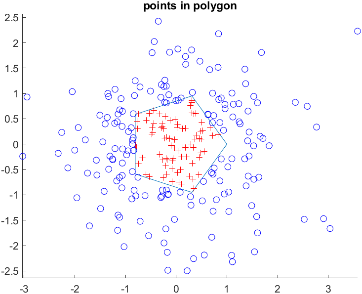
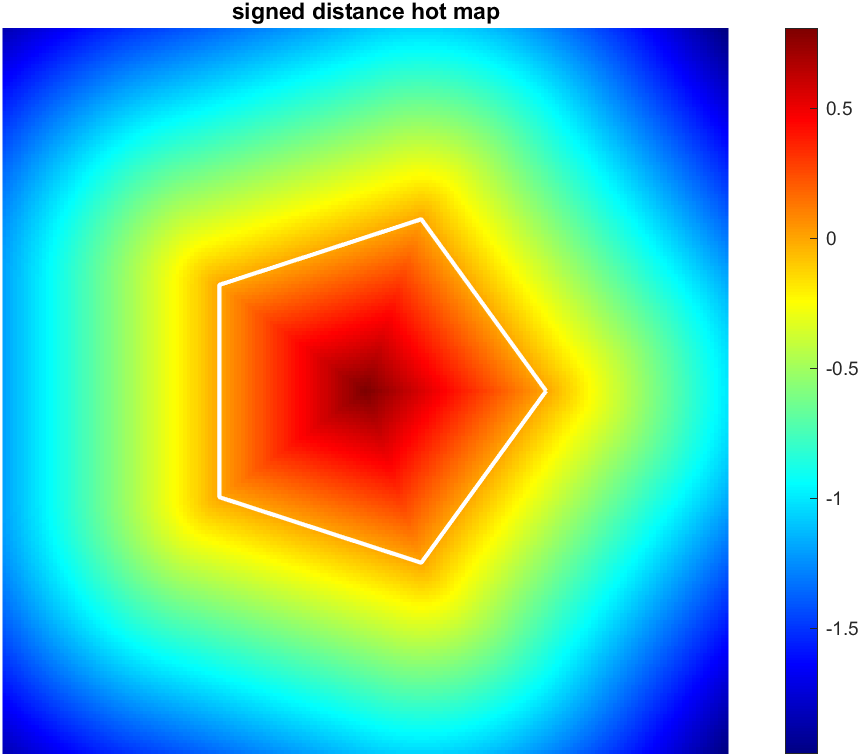

[](https://ww2.mathworks.cn/matlabcentral/fileexchange/119418-pointpolygontest) 
[](https://matlab.mathworks.com/open/github/v1?repo=cuixing158/pointPolygonTest&file=demo.m)
[](https://raw.githubusercontent.com/cuixing158/OpticalFlow-Visualization/refs/heads/main/README_media/sponsors.jpg)

# Points In Polygon Test

This function [`inpolygon2`](./inpolygon2.m) is an enhancement of matlab's built-in function [`inpolygon`](https://www.mathworks.cn/help/matlab/ref/inpolygon.html), which supports the calculation of the distances.Support C/C++ code generation.

:eyes:[View the example](https://viewer.mathworks.com/?viewer=plain_code&url=https%3A%2F%2Fww2.mathworks.cn%2Fmatlabcentral%2Fmlc-downloads%2Fdownloads%2F86ed6463-8f26-4463-acc2-d739927612b1%2F53ec9495-8b54-49be-8855-fce595cdfa4e%2Ffiles%2Fdemo.m&embed=web) 
:arrow_forward:[Run the example](https://matlab.mathworks.com/open/github/v1?repo=cuixing158/pointPolygonTest&file=demo.m)

## Example

```matlab
%% data, is same as https://www.mathworks.cn/help/matlab/ref/inpolygon.html fisrst Example
L = linspace(0,2*pi,6);
xv = cos(L)';
yv = sin(L)';

rng default
xq = randn(250,1);
yq = randn(250,1);

%% use inpolygon2 function determine points whether inside polygon 
points = [xq,yq];
dists = inpolygon2([xv,yv],points);

figure;hold on
plot(xv,yv) % polygon
plot(xq(dists==1),yq(dists==1),'r+') % points inside
plot(xq(dists==-1),yq(dists==-1),'bo') % points outside
axis equal;
title("points in polygon")
```



```matlab
%% Distance Rating Heat Map
xy=-2:.02:2;
[x,y] = meshgrid(xy);
points = [x(:),y(:)];
dists2 = inpolygon2([xv,yv],points,true);
dists2 = reshape(dists2,size(x));

figure;hold on;
xydata = [xy(1),xy(end)];
imagesc(xydata,xydata,dists2)
plot(xv,yv,'w-','LineWidth',2)
colormap('jet');
colorbar
axis equal off
title("signed distance hot map")
```


